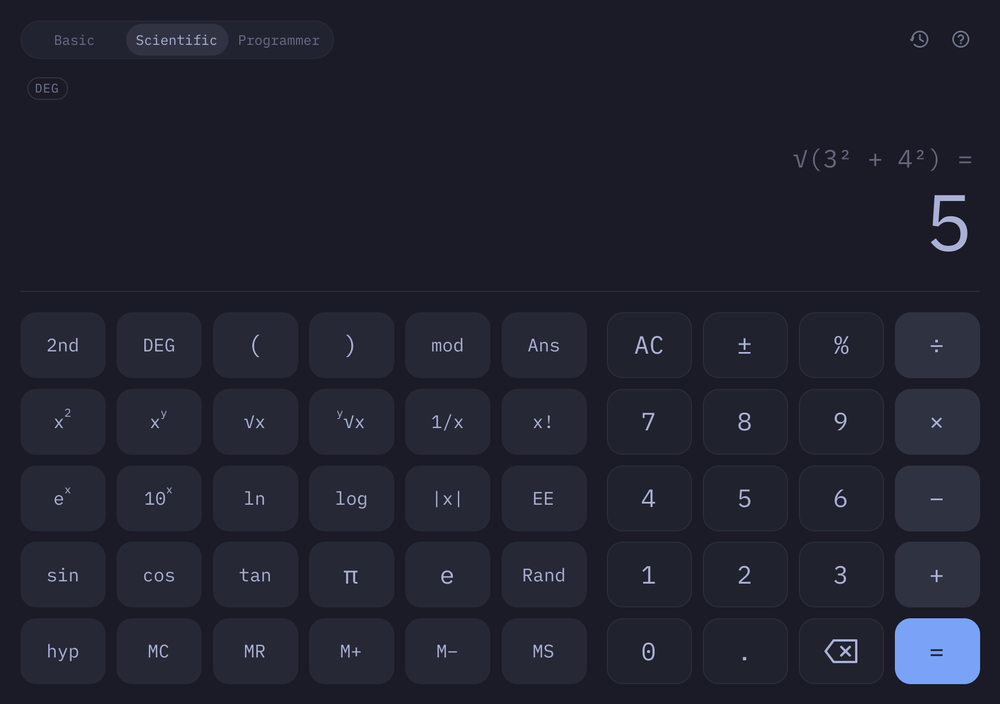
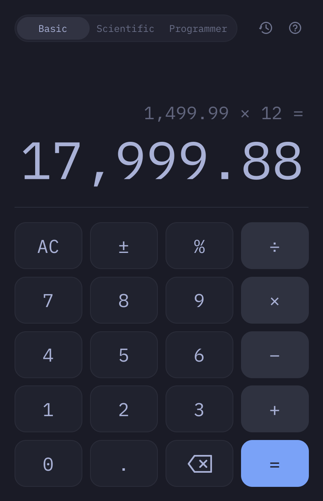
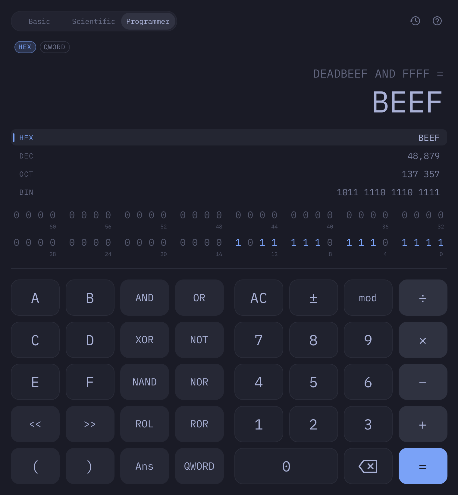

# Bettercalc

A calculator for [Omarchy](https://omarchy.org) with basic, scientific and
programmer modes. It starts from [Omacalc](https://github.com/omacom/omacalc)'s
look and keyboard-first feel and adds full expressions, a live preview,
history, and the functions a scientific or programmer calculator needs. Like
Omarchy's own apps, it is built with Qt Quick and C++ and follows the Omarchy
theme live.



<p>


</p>

## Install

```sh
bin/install
```

This builds the app and installs it as an Arch package with `makepkg -fsi`,
so Bettercalc shows up in the Omarchy app launcher (`Super + Space`).

Omarchy floats Omacalc and opens it with `Super + Ctrl + Q` and the
Calculator key. To give Bettercalc the same treatment, add a window rule to
`~/.config/hypr/hyprland.lua`:

```lua
o.window("bettercalc", { float = true })
```

and take over the bindings in `~/.config/hypr/bindings.lua`:

```lua
o.rebind("SUPER + CTRL + Q", "Calculator", { launch = "bettercalc" })
o.rebind("XF86Calculator", "Calculator", { launch = "bettercalc" })
```

## How it works

You type a whole expression, and Bettercalc shows it as you go: the expression
on the upper line and, below it, a live preview of its value in a muted color.
`=` commits the result, which settles into place in full color and is added
to the history.

- **Precedence works.** `2 + 3 × 4` is 14. Powers bind tightly and associate
  to the right, so `−2²` is −4 and `2^3^2` is 512.
- **Function keys work on the number you just typed.** Type `9` and press `√x`
  to get `√(9)`. With no number yet, the key opens the function for you to fill
  in. Applied to a negative number or a power, `x²` squares the whole thing:
  `−3`, `x²` gives 9.
- **Parentheses close themselves.** The ones you still owe show as faint ghosts
  and are closed for you when you press `=`.
- **Mistakes are explained.** `1 ÷ 0` says *Can't divide by zero*, and the
  expression stays on screen to fix with Backspace rather than being thrown
  away.
- **Results chain exactly.** `1 ÷ 3 = × 3 =` gives exactly 1. Digits after `=`
  start a new calculation; an operator continues from the result.
- **Percent works the way you'd expect.** `200 + 10%` is 220, `200 × 10%`
  is 20.
- **Undo and redo** go back through every change, including base and word size
  changes. **History** keeps your last 100 results, even after a restart.
  Click an entry to use its result again.
- **Click the result** (or press `Ctrl + C`) to copy it as a plain number.
  Pasting accepts numbers and expressions from anywhere: grouped digits,
  decimal commas, `×` and `÷`, and `0x`, `0o` and `0b` literals in programmer
  mode.

### Basic

Omacalc's keypad: the four operators, percent, sign and backspace.

### Scientific

The basic keypad, plus:

| Key | Does |
| --- | --- |
| `2nd` | Switches `x²`, `√x`, `10ˣ`, `log` and the trig keys to `x³`, `∛x`, `2ˣ`, `log₂` and their inverses |
| `hyp` | Switches the trig keys to `sinh`, `cosh` and `tanh` |
| `DEG` | Cycles degrees, radians and gradians |
| `x²` `xʸ` `√x` `ʸ√x` `1/x` `x!` | Powers, roots, reciprocal, factorial (the gamma function between integers) |
| `eˣ` `10ˣ` `ln` `log` `\|x\|` | Exponentials, logarithms, absolute value |
| `sin` `cos` `tan` | Exact at whole quarter turns: `sin 180°` is 0, `tan 90°` is undefined |
| `π` `e` `Ans` `Rand` | Constants, the last result, a random number |
| `EE` | Exponent entry: `1.5 EE 3` is 1,500 |
| `mod` | Floored modulo: `−7 mod 3` is 2 |
| `MC` `MR` `M+` `M−` `MS` | Memory |

### Programmer

Integer arithmetic on a 64, 32, 16 or 8-bit word, in two's complement.

- **Every base at once.** The current value is shown in hex, decimal, octal and
  binary; click a row (or press F5–F8) to work in that base. The expression is
  converted along with it, so `FF + 1` in hex becomes `255 + 1` in decimal.
- **Every bit, clickable.** The 64 bits below show the value; click one to flip
  it. Bits beyond the word size stay faintly visible.
- **Word size.** `QWORD`, `DWORD`, `WORD` and `BYTE`. Narrowing truncates like
  a C cast. Decimal is signed, so `FF` in a byte is −1.
- **Operators.** `AND`, `OR`, `XOR`, `NOT`, `NAND`, `NOR`, shifts (`>>` is
  arithmetic), rotates, and `mod`. Division truncates toward zero, like C.
  Precedence follows C as well: arithmetic, then shifts, then `AND`, `XOR`
  and `OR`.

## Keyboard

Everything works from the keyboard. Press `?` in the app for this list.

| Keys | Action |
| --- | --- |
| `0`–`9` `.` `(` `)` | Numbers and grouping (`,` also works as the decimal point) |
| `+` `-` `*` `/` | Arithmetic |
| `Enter`, `=` or `Space` | Calculate |
| `Backspace` | Delete the last entry (names like `sin(` go in one press) |
| `Esc` or `Delete` | Clear |
| `Ctrl + Z` / `Ctrl + Shift + Z` | Undo / redo |
| `Ctrl + C` / `Ctrl + V` | Copy the result / paste |
| `Ctrl + 1` `2` `3` | Basic, scientific, programmer |
| `Ctrl + H` | History |
| `?` | Keyboard help |
| `Ctrl + Q` | Quit |

Basic and scientific:

| Keys | Action |
| --- | --- |
| `%` | Percent |
| `^` `!` | Power, factorial |
| `E` | Exponent: `1.5E3` |
| `a`–`z` | Type names directly: `sin(`, `sqrt(`, `ln(`, `pi`, `ans`, `mod` |
| `Ctrl + D` | Degrees, radians, gradians |

Programmer:

| Keys | Action |
| --- | --- |
| `a`–`f` | Hex digits |
| `&` `\|` `^` `~` | AND, OR, XOR, NOT |
| `<` `>` | Shift left, shift right |
| `%` | Remainder (`mod`) |
| `F5` `F6` `F7` `F8` | HEX, DEC, OCT, BIN |
| `F12` `F2` `F3` `F4` | QWORD, DWORD, WORD, BYTE |

Plain letters are for typing function names, so quitting is `Ctrl + Q` rather
than Omarchy's usual `Q`.

## Theme

Colors follow the current Omarchy theme
(`~/.local/state/omarchy/current/theme/colors.toml`): its background,
foreground and accent, plus red for errors. They change live when you switch
themes. Light themes get a light calculator. Without Omarchy, Bettercalc
follows the desktop's light or dark preference. Text follows the desktop text
size (`omarchy display text size`, or GNOME's `text-scaling-factor`).

## Development

```sh
bin/build    # qmake6 + make into build/bettercalc
bin/test     # builds and runs the Qt Test suite offscreen
```

The arithmetic lives in `src/engine.cpp`, a tokenizer and two recursive-descent
evaluators (double precision and 64-bit integer) with no Qt Quick in sight.
`src/backend.cpp` turns key presses into an expression and exposes the display
to QML, and `src/theme.cpp` follows the Omarchy palette. The interface is
`src/Main.qml` and the components beside it.

The project was built with the `omarchy-app` skill from
[basecamp/omarchy](https://github.com/basecamp/omarchy), which is installed,
along with the `omarchy` skill, in `.claude/skills/`.

## Requirements

- Qt 6: `qt6-base`, `qt6-declarative`, `qt6-wayland`
- `xdg-desktop-portal` and a portal backend, for the desktop's dark mode and
  text size

## Credits

Bettercalc grows out of Omacalc by David Heinemeier Hansson (MIT). The key
style, backspace glyph, theme handling and system theme bridge come from it.
The iA Writer Mono font is bundled under the SIL Open Font License 1.1; see
`fonts/OFL.txt`. The font is copyright Information Architects Inc. and based on
IBM Plex, copyright IBM Corp.
